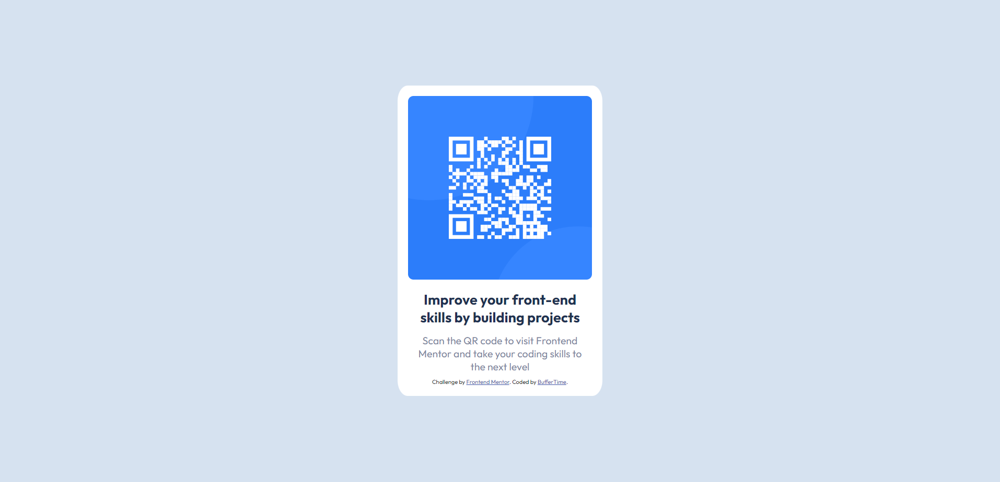

# Frontend Mentor - QR code component solution

This is a solution to the [QR code component challenge on Frontend Mentor](https://www.frontendmentor.io/challenges/qr-code-component-iux_sIO_H). Frontend Mentor challenges help you improve your coding skills by building realistic projects. 

## Table of contents

- [Overview](#overview)
  - [Screenshot](#screenshot)
  - [Links](#links)
- [My process](#my-process)
  - [Built with](#built-with)
  - [What I learned](#what-i-learned)
    - [HTML5](#html5)
    - [CSS3/SASS](#css3-sass)
  - [Continued development](#continued-development)
  - [Useful resources](#useful-resources)
- [Author](#author)
- [Acknowledgments](#acknowledgments)

## Overview

### Screenshot

### Links

- Solution URL: [Add solution URL here](https://your-solution-url.com)
- Live Site URL: [Add live site URL here](https://your-live-site-url.com)

## My process

### Built with

- HTML5
- CSS custom properties
- Flexbox
- SASS

This is my first project so I expect a lot of mistakes. I just learned HTML5 and CSS3 this July, and also learned SASS a while ago for this project.

### What I learned

#### HTML5

  1. To open a page on a new tab - <a href="" target="_blank">

#### CSS3 SASS

  1. Universal/global selector - *
  2. Fonts to be used - @import url('link')
  3. Auto center horizontally - margin: 0 auto;

### Continued development

Will continue to practice Flexbox and Grid in the future. Probably also adding simple transitions like box-shadow when hovered.

### Useful resources

- [Learn Sass In 20 Minutes | Sass Crash Course](https://youtu.be/Zz6eOVaaelI) - Learned how to operate the basics of SASS for 5 mins before starting project.

## Author

- GitHub - [BufferTime](https://github.com/BufferTime)
- Frontend Mentor - [@BufferTime](https://www.frontendmentor.io/profile/BufferTime)

## Acknowledgments

After finishing my project, I also checked how other people formatted theirs:
- [QR Code Component by Mr Coder](https://www.youtube.com/watch?v=5BBYPntB-GY)
  - Brief and easy explanations for beginners.

- [QR Code Component by TsbSankara](https://www.youtube.com/watch?v=JFyMWwOxHYM)
  - Much more detailed explanations re: the format of the box/card on the page.
  - Also, I missed the box-shadow detail on the reference image. They were able to point this out in their video.

- [Viewport Widths](https://developer.mozilla.org/en-US/docs/Web/CSS/@media/width)
  - I haven't studied responsive design yet. I did not know how to use the given widths (mobile and desktop). However, this website helped me get the idea.